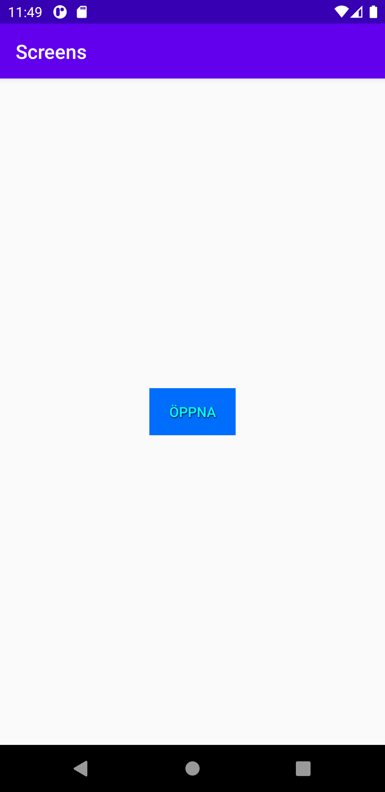
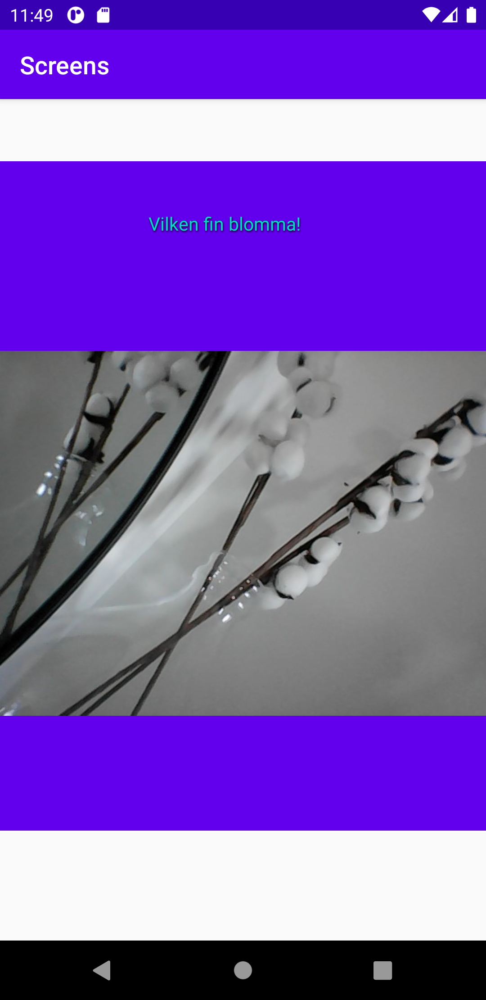

# Assignment 4
## Skapa en ny aktivitet
När en ny aktivitet skapas består den nya aktiviteten av en klass som i detta fallet fick namnet **second_actitivty.java** samt en layout fil som fick namnet **activity_second_activity.xml.** Second_activity.java består av java kod som är användbart för att kunna programmera de beteenderna som appen gör exempelvis när man som i denna uppgiften klickar på en knapp. Layoutfilen är till för att skapa layoutens utseende.

## Skapa en button i en linearlayout
För att skapa en knapp som skulle visas på första sidan när man öppnar appen implementerades en **button** in i **main_activity.xml** filen. I button valdes det att height och width skulle få wrap_content på grund av att knappen enbart ska ta den plats som den behöver med anledningen att den ska se ut som en knapp. Om match_parent hade valts hade knappens utformning tagit upp hela raden vilket hade varit missvisande för användaren att det är en knapp. För att komma åt knappen i java filen behövs det läggas till ett id i knappen. Knappens id blev open då knappen ska öppna en annan sida. För att sätta texten som står på knappen användes attributet text. Som stylingen valdes det att sätta en färg på texten ifrån attributet text i en ljusblå färg. Det valdes också en bakgrundsfärg för knappen vilket blev en mörkare blå färg för att ge en kontrast både mot bakgrunden av appen men också ifrån texten på knappen. För att göra det ännu mer tydligt för användaren att det är en knapp skapades det även skugga på texten. För att få knappen placeras i mitten på ett bra sätt användes linear layout med en orientation vertikal. För att göra så att knappen ska hamna i mitten av appen används också constraintbottom, left, right och top.

```
    <LinearLayout
    android:layout_width="wrap_content"
    android:layout_height="wrap_content"
    android:orientation="vertical"
    app:layout_constraintBottom_toBottomOf="parent"
    app:layout_constraintLeft_toLeftOf="parent"
    app:layout_constraintRight_toRightOf="parent"
    app:layout_constraintTop_toTopOf="parent">

    <Button
        android:id="@+id/open"
        android:layout_width="wrap_content"
        android:layout_height="wrap_content"
        android:text="Öppna"
        android:textColor="#00FCFC"
        android:background="#006DFC"
        android:shadowColor="#000000"
        android:shadowDx="1"
        android:shadowDy="2"
        android:shadowRadius="3" />
    </LinearLayout>
```

## Knappens utseende

## Få activity_main som första sida
På grund av att knappen implementerades på activity_main.xml behövs det i filen **androidManifest.xml** ändras ordning på aktiviteterna. **Activitymain** lades därför före **second_activity** på grund av att activitymain är den sidan som ska visas först och second_activity är den sidan som användaren ska komma till när den klickar på knappen.

```
    <activity android:name=".MainActivity">
    <intent-filter>
        <action android:name="android.intent.action.MAIN" />

        <category android:name="android.intent.category.LAUNCHER" />
    </intent-filter>
    </activity>
    <activity android:name=".Second_activity">
    <intent-filter>
        <action android:name="android.intent.action.MAIN" />

        <category android:name="android.intent.category.LAUNCHER" />
    </intent-filter>
    </activity>
```

## Interagera med button
För att användaren ska kunna interagera med knappen och alltså komma till den andra aktiviteten second_acitity behövs button hittas med hjälp av metoden **findViewByID**. För typen angavs Button samt en variabel som fick namnet `open` och därefter findViewByID för att sedan hämta id:et open ifrån activity_main.xml filen. För att det ska hända något när användaren klickar på knappen användes en **clicklistener** på buttonobjektet. Genom den angivna variabeln open kopplas de samman för att sedan skapa en ny **View.OnClickListener**. När detta görs skapades det också en public void onClick. För att kontrollera att knappen går att interagera med lades det till en Log.d med en tag som gör att när man interagerar med knappen kommer det upp i Logcut att den har öppnats.

## Intent
För att kunna starta en ny aktivitet måste **intent** användas. En intent är ett medelandeobjekt som gör att data kan överföras mellan aktiviteter. I intent används två parametrar en kontext och en klass. På grund av att activity är en underklass anges kontexten först sedan anges klassen vilken är den aktiviteten som kommer att startas. Intent ligger placeras inuti public void onClick på grund av att det är den som gör att när användaren klickar på knappen så ska den nya aktiviteten visas.

```
    Button open = findViewById(R.id.open);
    open.setOnClickListener(new View.OnClickListener() {
    @Override
    public void onClick(View view) {
        Intent intent = new Intent (MainActivity.this, Second_activity.class);
        startActivity(intent);
        Log.d("TAG", "Öppna");

    }
    });
```
## Fragment
Fragment har olika syften och det första syftet är att fragment kan användas för att kunna erhålla olika layouter beroende på vad för parametrar, skärmorientering och skärmstorlek det är som användaren använder. Fragment kan också användas för att representera olika flikar samt kan täcka hela aktivitetsytor. Fragment skapades genom kommandot file->new->fragment ->fragment blank. När fragment deklarerats skapades det en ny java fil med redan implementerad kod samt en layoutfil. Efter att fragment deklarerats lades fragment in i **activity_second_acktivity.xml** filen då det är den filen som syns när användaren klickat på knappen. För att kunna koppla fragment till fragment java filen användes attributet name där com.example.screens lades till vilket är mappen som filen Blank_fragment ligger i. Därefter angavs det en width och en height där width tilldelades en match_parent och height tilldelades wrap_content. Anledningen till att width tilldelades match_parent var för att fragment skulle vara lika bred på skärmen och anledningen till att height fick wrap_content var för att inte fragment skulle ta upp hela skärmen. I tag attributet angavs det den filen som fragment blivit skapad i vilket är xml filen fragment_blank_fragment.xml. För att flytta ner fragment användes en margintop.

```
    <fragment
    android:name="com.example.screens.Blank_fragment"
    android:layout_width="match_parent"
    android:layout_height="wrap_content"
    android:tag="fragment_blank_fragment"
    android:layout_marginTop="50dp">
    </fragment>
```

## Imagesview
Enligt uppgiften skulle en widgets skapas inuti fragment och den som implementerades var en imagesview. Som width och height angavs det wrap-content för att bilden inte behöver ta mer plats än vad den behöver. För att lägga in bilden angavs det i attributet srcCompat bildfilens namn.

```
    <ImageView
    android:layout_width="wrap_content"
    android:layout_height="wrap_content"
    app:srcCompat="@drawable/blomma"
    />
```

## Styling av fragment
För att styla fragment användes fragment lyoutfilen där en bakgrundsfärg lades in i en mörkblå nyans. I layoutfilen fanns det redan en implementerad textview med texten **Vilken fin blomma!**. Det valdes också att implementeras en paddinghorizontal för att placera texten i mitten av fragment. För att texten också skulle placeras längre ner ifrån fragments top användes en margintop. Med anledningen att skapa en samma känsla som knappen hade angavs det samma färg på texten samt samma skuggning. För att göra texten lite större angavs det också en textsize i storleken 15sp. Detta för att inte göra texten så plottrig.

```
    <?xml version="1.0" encoding="utf-8"?>
    <LinearLayout xmlns:android="http://schemas.android.com/apk/res/android"
    xmlns:tools="http://schemas.android.com/tools"
    xmlns:app="http://schemas.android.com/apk/res-auto"
    android:layout_width="wrap_content"
    android:layout_height="wrap_content"
    android:orientation="vertical"
    tools:context=".Blank_fragment"
    android:background="@color/colorPrimary"
    >

    <TextView
        android:layout_width="match_parent"
        android:layout_height="match_parent"
        android:text="Vilken fin blomma!"
        android:paddingHorizontal="120dp"
        android:layout_marginTop="40dp"
        android:textColor="@color/colorAccent"
        android:shadowColor="#000000"
        android:shadowDx="1"
        android:shadowDy="2"
        android:shadowRadius="3"
        android:textSize="15sp"
        />

    </LinearLayout>
```

## Fragments utseende
